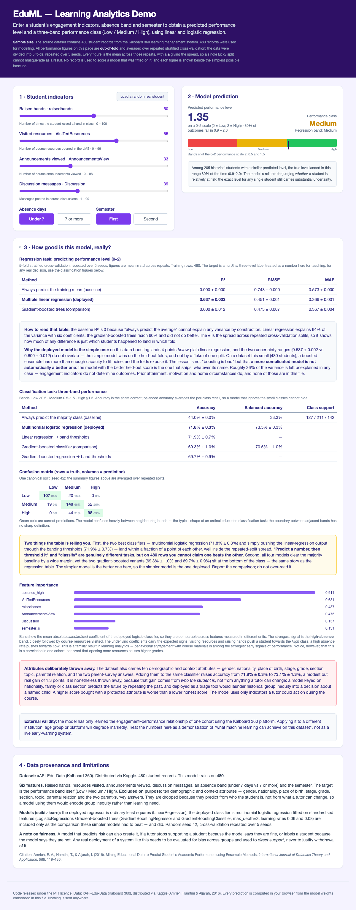

# Student Performance Prediction Demo (Learning Analytics Teaching Demo)

**Live demo (GitHub Pages): <https://drhycheung.github.io/EduML/>**



A single-file, front-end-only interactive demo that predicts **student performance level**
and a three-band performance class from engagement and attendance indicators, using linear
and logistic regression that run entirely in the browser. The two models were chosen because
they beat gradient-boosted trees on held-out data here — the comparison is shown on the page.
Built for classroom demonstration in **Learning Analytics**, **Educational Data Mining** and
**AI in Education** courses.

File: `index.html` — no build step, no backend, no API key, **no network requests at
all**. Double-click it from disk and it works, offline. Drop it into a GitHub Pages
repository and it is deployed.

---

## 1. Where this project fits: From description to prediction

Learning analytics can be understood through three activities: **monitor**, **analyse** and **predict**. Most data-driven projects combine elements of more than one.

This project collects the engagement signals a dashboard would display — raised hands, resources visited, announcements viewed, discussion posts, absences (monitor); fits a statistical model that relates those signals to performance (analyse); and turns them into a forward-looking estimate with the uncertainty attached (predict).

A dashboard can only describe what has already happened. It cannot answer *"is this student heading for trouble — should we reach out now, while there is still time to help?"* Data without prediction produces description, not decisions. The prediction therefore occupies the prime position on the page, in the largest type, with the Low / Medium / High scale showing where the estimate lands against the 0.5 and 1.5 level boundaries — because that band *is* the decision the tutor is trying to make. The evaluation tables are supporting evidence, not the headline.

A user must be able to set a student's profile and get a prediction. A tool that can only
replay historical rows has quietly become a dashboard; that distinction is the teaching
point.

## 2. What the page does

| Feature                                          | Implementation                                                                                                                  |
| ------------------------------------------------ | ------------------------------------------------------------------------------------------------------------------------------- |
| **Predict performance level from 4 sliders + 2 toggles** | The headline output, centre of the page. Ordinary least squares serialised as six weights and an intercept; evaluated in ~5 lines of vanilla JS |
| **Actionable class against a band**              | A multinomial logistic classifier gives Low / Medium / High, with a marker on the 0–2 level scale at the 0.5 and 1.5 boundaries  |
| Evaluate any student profile                     | Sliders accept any engagement counts, absence band and semester within the training range                                       |
| No ML library in the browser                     | scikit-learn's fitted coefficients exported as plain numbers (a weight per feature, plus a stored z-score scaler for the classifier) |
| Honest evaluation panel                          | Out-of-fold 5-fold CV metrics, with a predict-the-mean baseline and, beside the deployed model, both simpler and more complex alternatives |
| Prediction interval                              | Empirical 10th–90th percentile of out-of-fold residuals, bucketed by predicted level                                            |
| An honest loss                                   | The page shows that gradient boosting scores *below* the simple linear model it deploys here (R² 0.600 vs 0.637) and explains why that is not a bug |
| Reported with uncertainty                        | Every figure is a mean ± std over repeated stratified cross-validation, so a lucky split cannot masquerade as a result |
| Task-design comparison                           | Accuracy of direct classification vs. thresholding the regression output                                                        |
| Feature importance                               | Table with bars, plus a plain-language reading of why the absence band and resource-visiting dominate                           |
| "Load a random real student"                     | 60 held-out rows; shows the model's prediction next to the observed class                                                       |
| Slider bounds from the data                      | Every slider range is read from the model file, so it can never be narrower than the training data                              |
| Zero dependencies                                | All CSS vendored inline, no CDN, no web fonts, no `fetch()`                                                                     |

> **New to machine learning?** §1 of the [model notes](docs/model-notes.md#1-the-algorithms-in-plain-language)
> explains baselines, linear regression, decision trees, gradient boosting and
> cross-validation from first principles, and traces a real prediction through the
> exported coefficients.

## 3. Data, and the attributes that had to go

Source: [xAPI-Edu-Data (Kalboard 360)](https://www.kaggle.com/datasets/aljarah/xAPI-Edu-Data)
(Amrieh, Hamtini & Aljarah, 2016), 480 student records from a multi-agent learning
management system. The dataset has no missing values, so all **480** rows are used.

<details>

<summary><strong>Download the data</strong> (if you do not have it — a copy is already committed at <code>data/xAPI-Edu-Data.csv</code>)</summary>

```bash
mkdir -p data
kaggle datasets download -d aljarah/xAPI-Edu-Data -p /tmp/xapi
unzip -o /tmp/xapi/xAPI-Edu-Data.zip -d data     # yields xAPI-Edu-Data.csv
```

This needs the Kaggle CLI and a free API token at `~/.kaggle/kaggle.json`
(Kaggle → Account → Create New API Token).

Verify before you use it:

```bash
wc -l data/xAPI-Edu-Data.csv     # must be 481  (480 rows + header)
head -1 data/xAPI-Edu-Data.csv   # gender,NationalITy,PlaceofBirth,...,Class
```

The committed copy is byte-identical to a fresh download.

</details>

Six features: times the student raised a hand, course resources visited, announcements
viewed, discussion posts, an absence band (7 or more absence days), and the semester.

**Who the student is, rather than what they do, is missing — and that is the most
important thing on the page.** The dataset also carries ten demographic and context
attributes: gender, nationality, place of birth, educational stage, grade, section, topic,
parental relation, whether a parent answered the survey, and parental school satisfaction.

Adding those ten attributes raises cross-validated accuracy from 0.718 ± 0.003 to
**0.731 ± 0.013**. That "improvement" is not something a tutor can act on: the model would
be predicting a student's outcome from *who they are* — nationality, family, which section
they were sorted into — rather than from anything support could change. Nor is it trivial
background: the ten attributes **on their own** reach 0.547 ± 0.010, a full ten points above
the 0.440 majority-class baseline, so they do carry predictive signal. Used to triage support,
that signal would launder historical group inequity into a decision about a named child. The
gain is bought with group membership, not with learning, so the attributes are dropped and
the page says so out loud.

## 4. Results

All out-of-fold, 5-fold stratified cross-validation repeated over 5 seeds. Every figure is
the mean ± std across the repeats, so a lucky split cannot masquerade as a result.

**Regression — performance level (Low 0 · Medium 1 · High 2)**

| Method                              | R²                | RMSE            | MAE             |
| ----------------------------------- | ----------------- | --------------- | --------------- |
| Always predict the training mean    | −0.000 ± 0.000    | 0.748 ± 0.000   | 0.573 ± 0.000   |
| **Multiple linear regression (deployed)** | **0.637 ± 0.002** | 0.451 ± 0.001 | 0.366 ± 0.001 |
| Gradient-boosted trees (comparison) | 0.600 ± 0.012     | 0.473 ± 0.007   | 0.367 ± 0.004   |

Here the *simple* model wins, and the loss is real rather than a lucky split: the two R²
ranges (0.637 ± 0.002 vs 0.600 ± 0.012) do not overlap across repeats. With only 480 rows
and six near-additive inputs, the boosted trees have ample capacity to fit sampling noise
that does not reappear in the held-out fold, so plain linear regression generalises slightly
better. Model complexity has to earn its keep, and the page deploys whichever model the
held-out score favours — here, the simpler one — rather than the more impressive sounding
one. The remaining ~36% of the variance is not a modelling failure: engagement is not the
same thing as ability.

**Classification — three-band performance level** (Low < 0.5 · Medium 0.5–1.5 · High ≥ 1.5)

| Method                                              | Accuracy          | Balanced accuracy |
| --------------------------------------------------- | ----------------- | ----------------- |
| Always predict the majority class                   | 44.0% ± 0.0%      | 33.3%             |
| **Multinomial logistic regression (deployed)**      | **71.8% ± 0.3%**  | **73.5% ± 0.3%**  |
| Linear regression → band thresholds                  | 71.9% ± 0.7%      | —                 |
| Gradient-boosted classifier (comparison)            | 69.3% ± 1.0%      | 70.5% ± 1.0%      |
| Gradient-boosted regression → band thresholds       | 69.7% ± 0.9%      | —                 |

The two best rows — logistic regression and simply banding the regression output — are
**indistinguishable** (71.8% vs 71.9%, a 0.1-point gap, well inside the ±0.3–0.7-point
spread). "Predict a number, then threshold it" and "classify" are different tasks, but on 480
rows you cannot claim one beats the other. What *is* clear is the ordering below them: both
gradient-boosted variants sit at the bottom of the class, two to three points back, echoing
the regression table. The page deploys the logistic classifier (chosen over thresholding for
its calibration and because it comes with probabilities); the full confusion matrix — which
shows the errors piling up between neighbouring bands — is printed on the page.

## 5. How to run

- **Students, teachers, anyone**: double-click `index.html`. It needs nothing else —
  no server, no network, no installation. This is the intended way to use it.
- **Locally with a server** (only if you want to edit): `python3 -m http.server 8000`,
  then visit `http://localhost:8000/index.html`. Functionally identical.
- **GitHub Pages (your own deployment)**: push `index.html` to *your* repository, then
  enable Pages via **Settings → Pages → Deploy from a branch** (branch + `/ (root)`).
  Yours will live at `https://<your-username>.github.io/<repo-name>/`. The link at the
  top of this README is the author's own deployment.

### Rebuilding from source

`index.html` is generated. Edit the sources, not the output.

```bash
python3 scripts/train_model.py    # retrain -> model/model.json   (~10 s)
python3 scripts/build_page.py     # inline model + CSS -> index.html
python3 scripts/verify_page.py    # prove the page still agrees with Python
```

`verify_page.py` runs the in-page inference under Node.js on 200 synthetic rows, checks it
agrees with an independent Python re-implementation, and refits both models with scikit-learn
to confirm the exported coefficients reproduce them; it exits non-zero on any disagreement
greater than 1e-9. It also fails the build if any CSS class used by the page is missing from
the vendored stylesheet. See the [model notes](docs/model-notes.md) for what it covers and why
it exists.

## 6. Known limitations

Several of these are consequences of the constraints in §3 rather than oversights:

| Limitation                                          | Consequence                                                                                                  |
| --------------------------------------------------- | ------------------------------------------------------------------------------------------------------------ |
| Trained **only** on one Kalboard 360 cohort         | Applying it to another institution, age group or platform degrades markedly. It is a demonstration of method, not a live early-warning system |
| **Demographics and context excluded**               | Caps accuracy at 71.8%; §3 explains why the extra 1.3 points are not worth the fairness cost                  |
| Engagement inputs only — no prior attainment        | The unexplained ~36% of variance is structural, not fixable by a better learner                               |
| Small-n: ~96 students per fold, effect sizes near noise | The logistic classifier and the thresholded regression differ by 0.1 points — well inside the spread. Treat the ranking of near-tied methods as unsettled |
| Single-platform training set                        | No claim of generalisation across institutions, sectors or instrument types                                  |
| Class bands are ordinal level cuts at 0.5 / 1.5     | Adjacent bands have no sharp educational boundary, which is why the confusion matrix is full of near-misses    |
| Prediction interval is empirical, not probabilistic | It reports where the truth *usually* landed for similar students, not a calibrated 80% credible interval      |
| Correlation, not causation                          | A student who opens more resources is not *made* more able by the clicking                                    |
| A model that predicts risk can also create it       | Used to withdraw support, or to label a flagged student, it can harm the very outcomes it predicts             |
| Coefficients rounded when exporting                 | The JS-vs-Python self-check absorbs this (max deviation 8.9 × 10⁻¹⁶), and the exported weights reproduce a fresh scikit-learn fit to the last bit |
| `src/vendored.css.html` is a vendored snapshot      | Adding a new utility class without regenerating it yields an unstyled element; `verify_page.py` fails the build to stop this |
| Desktop-first layout                                | Tested at 390 px and 1280 px with no horizontal overflow, but not a full mobile design                        |

## 7. Documentation

| Document | What it covers |
|---|---|
| **[Vibe-coding guide](docs/vibe-coding.md)** | The design-thinking rationale (why a dashboard that only looks back cannot lead to an action), how the page was built with an AI coding tool, three faults that measurement detected and visual inspection did not, further work for students, and the complete prompt needed to reproduce the page, including how to download the dataset |
| **[Model notes](docs/model-notes.md)** | **The algorithms explained from first principles** (baseline, linear and logistic regression, decision trees, gradient boosting, cross-validation and stratification), followed by how the linear/logistic model is serialised, the verification harness, the empirical interval, and why the simpler model is deployed over gradient boosting here |
| **[Dataset card](docs/dataset.md)** | Provenance, every column and the reason it is or is not used, and the data-quality notes (duplicate rows, class imbalance, and the absence band's near-proxy relationship with the label) |

## 8. Licences & attribution

- **Code**: MIT — see [LICENSE](LICENSE), © 2026 drhycheung.
- **Data**: [xAPI-Edu-Data (Kalboard 360)](https://www.kaggle.com/datasets/aljarah/xAPI-Edu-Data)
  (Amrieh, Hamtini & Aljarah, 2016), CC BY-SA 4.0, distributed via Kaggle. Copyright
  remains with the original authors, The University of Jordan.

The two are separately licensed: the MIT licence covers this repository's code only and
does not extend to the dataset, which stays under CC BY-SA 4.0.
